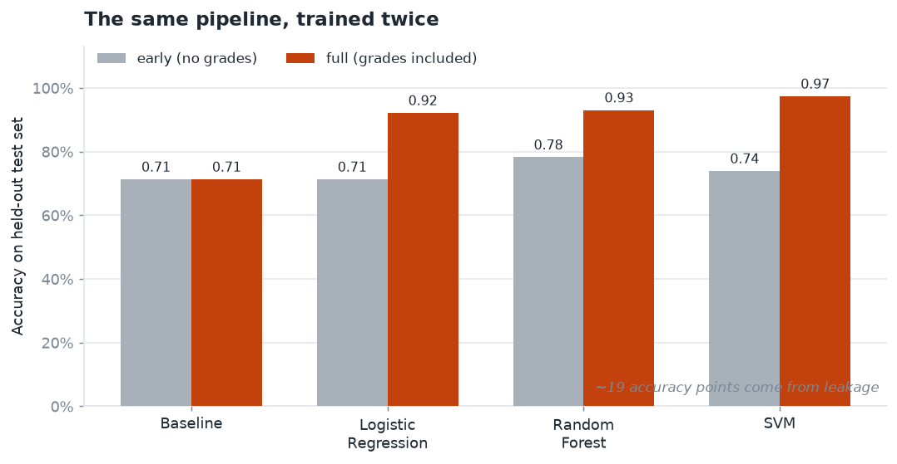
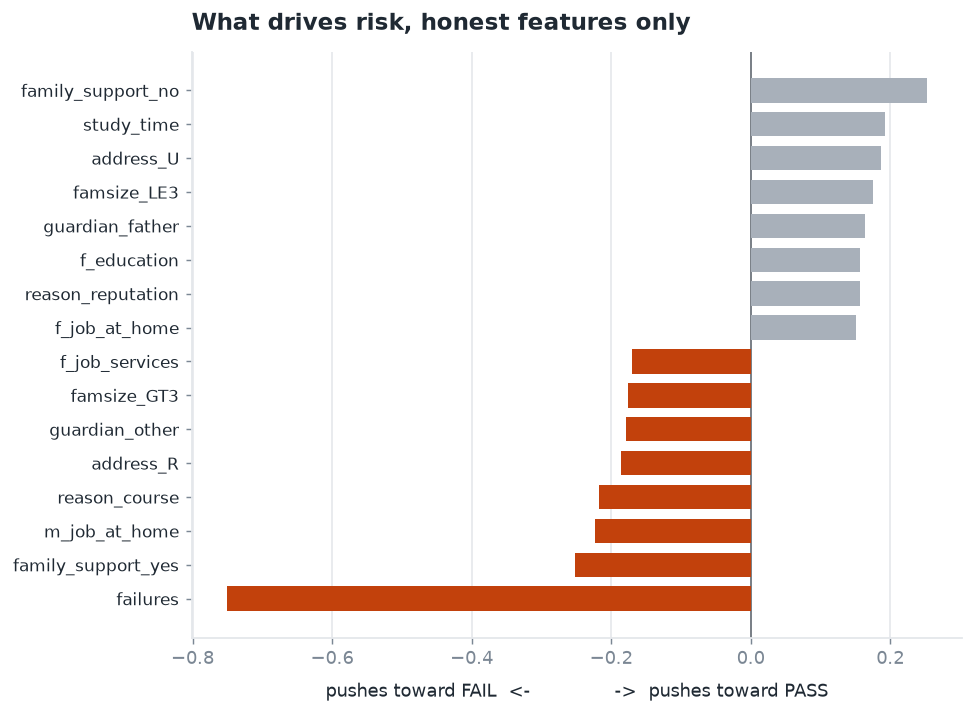
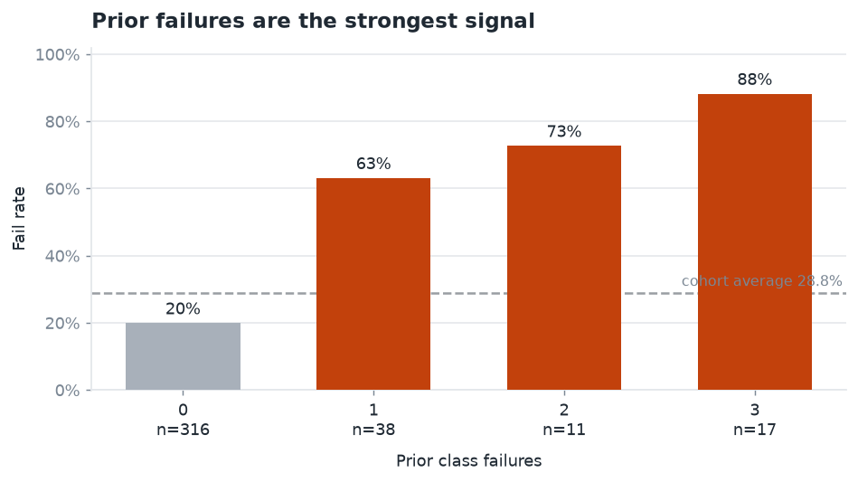

# Student Performance: Predicting Exam Failure, Honestly

An end to end machine learning project that predicts whether a secondary school student
will fail their final exam, and then shows how much of that predictive power was an
illusion caused by target leakage.

**[View the interactive dashboard](https://goodie-goody.github.io/final-grade-prediction/dashboard.html)**

## The headline result




The same pipeline, run twice on the same students, with one difference in the feature set:

| Feature set | Best model | Accuracy | Recall on FAIL | PR-AUC |
|---|---|---|---|---|
| `full` (includes term grades) | SVM | 0.974 | 0.970 | 0.989 |
| `early` (no grades at all) | Random Forest | 0.783 | 0.545 | 0.643 |
| Majority class baseline | none | 0.713 | 0.000 | 0.287 |

The first row looks excellent and means almost nothing. The pass or fail label is derived
from the subject grades, so a model given those grades is partly being handed the answer.
It also is not an early warning in any useful sense, because by the time third term grades
exist the window to intervene has closed.

The second row is the real result. Using only what a school would know before the exam
period (demographics, attendance, study time, prior class failures), the model reaches a
PR-AUC of 0.643 against a chance level of 0.287, so roughly 2.2 times better than guessing
at ranking students by risk. That is a modest but genuine signal, and it is the number
worth reporting.

Around 19 accuracy points of the original apparent performance came from leakage.

## Dataset and provenance

The data is the UCI Student Performance dataset (Cortez and Silva, 2008), collected from
Portuguese secondary schools and available publicly from the UCI Machine Learning
Repository under a CC BY 4.0 licence.

`build_dataset.py` rebuilds the working file from that original source so the whole chain
is reproducible:

1. Downloads the two real subject files (Mathematics and Portuguese).
2. Merges them on the 13 shared student attributes, which yields the 382 students who
   appear in both.
3. Renames columns to a Nigerian secondary school framing.
4. Maps the real grades: `maths_*` comes from the Mathematics file, `english_*` from the
   Portuguese file.
5. Generates `biology_*` and `yoruba_*` as clearly labelled synthetic columns, seeded for
   determinism. These are illustrative and do not correspond to any real measurement.
   Set `INCLUDE_SYNTHETIC_SUBJECTS = False` to leave them out entirely; the notebook
   detects grade columns dynamically and works either way.
6. Derives the binary `waec` target and the `score_band` column from the real subjects.

The Nigerian framing was informed by informal conversations with a secondary school
teacher and a few others about what affects student performance, and about possibly
extending the work with locally collected data. That extension was discussed but never
happened, so this project uses the public dataset described above rather than original
field data.

One consequence worth stating plainly: because the subject grades and the target are
derived from the same underlying scores, any model using term grades as features is
partly predicting an outcome from its own components. That is the leakage the project is
built to demonstrate.

## What is in this repo

| File | Purpose |
|---|---|
| `build_dataset.py` | Rebuilds `updated_data.xlsx` from the original UCI source |
| `Education_dataset.ipynb` | Modelling notebook: preprocessing, five models, two feature sets, evaluation, charts |
| `dashboard.py` | Generates `dashboard.html`, a two page interactive dashboard |
| `make_charts.py` | Generates the static PNGs in `images/` used by this README |
| `images/` | Static charts, so the repository page shows the results without any tooling |
| `updated_data.xlsx` | The generated dataset, committed so the repo runs without a rebuild |
| `requirements.txt` | Pinned dependencies |

## Reproducing

```bash
python -m venv .venv
source .venv/bin/activate        # fish: source .venv/bin/activate.fish
pip install -r requirements.txt

python build_dataset.py          # optional, updated_data.xlsx is already committed
python dashboard.py              # writes dashboard.html
python make_charts.py            # writes the PNGs in images/
```

Then run `Education_dataset.ipynb` top to bottom. Select the `.venv` interpreter as the
notebook kernel so it runs inside the environment.

## How the models were evaluated

Five classifiers (logistic regression, random forest, SVM, MLP, SGD) are trained on both
feature sets through a shared preprocessing pipeline, with one hot encoding for
categoricals and standard scaling for numerics. Every model is scored on a stratified
held out test set and compared against a majority class baseline, with 5 fold
cross validation reported alongside for stability. Class weighting is on wherever the
estimator supports it.

The headline metrics are recall on FAIL and PR-AUC rather than accuracy, because FAIL is
the minority class at roughly 29 percent and it is the class an early warning system
exists to catch.

Full results on the `early` feature set:

| Model | Accuracy | Recall (FAIL) | PR-AUC | CV accuracy |
|---|---|---|---|---|
| Random Forest | 0.783 | 0.545 | 0.643 | 0.745 (sd 0.032) |
| MLP | 0.730 | 0.515 | 0.622 | 0.723 (sd 0.052) |
| Logistic Regression | 0.713 | 0.697 | 0.597 | 0.704 (sd 0.062) |
| SVM | 0.739 | 0.303 | 0.551 | 0.771 (sd 0.028) |
| SGD | 0.548 | 0.818 | 0.549 | 0.603 (sd 0.147) |
| Baseline | 0.713 | 0.000 | 0.287 | n/a |

Two things in that table are worth pointing out.

Logistic regression scores exactly the same accuracy as the baseline, 0.713. On accuracy
alone you would conclude the model is worthless. Its recall on FAIL is 0.697 against the
baseline's 0.000, so it catches roughly seven in ten at risk students while the baseline
catches none. This is the clearest possible argument for not judging an imbalanced
problem by accuracy.

SGD posts the highest FAIL recall at 0.818, but with 0.548 accuracy and a cross validation
standard deviation of 0.147 it is simply flagging almost everyone as at risk. High recall
on its own is not a result.

Tuning an SVM specifically for FAIL recall (grid search over C and gamma) reached 0.636 on
the held out set, better than any untuned model's balance, which suggests that optimising
for the right metric matters more here than the choice of algorithm.

For deployment, logistic regression on the `early` set is the sensible pick. It is within
a few points of the best PR-AUC, it is stable across library versions, and it produces
interpretable coefficients.

## What actually drives risk





From the logistic regression coefficients on the `early` feature set, and confirmed
independently by the fail rates in the dashboard:

- Prior class failures dominate everything else, with a coefficient of -0.751. Students
  with no prior failures fail at 20 percent; students with three fail at 88 percent.
- Study time matters up to a point. The fail rate drops from 34 percent for students
  studying under two hours a week to 18 percent for those studying five to ten hours,
  with no further gain beyond ten hours.
- Maternal education shows a clear gradient, from 45 percent among students whose mothers
  have primary education to 18 percent for those with higher education.
- Longer commutes coincide with higher risk, but that panel rests on very few students,
  so treat it as a lead rather than a finding.
- Support factors (extra lessons, internet at home, extra curricular activities) each move
  the fail rate by only a few points. Notably, students receiving family support fail at a
  slightly higher rate, which most likely means support is directed towards students who
  are already struggling.

## Dashboard

`python dashboard.py` writes a self contained `dashboard.html` with two pages, one for
the risk factors and one for the leakage story. It replaces the original Power BI report
and fixes three problems that report had.

GitHub shows raw source rather than rendering `.html` files, so the dashboard is published
through GitHub Pages at the link at the top of this file. The static charts above are
generated by `make_charts.py` so that anyone landing on the repository page sees the
headline results immediately, without following a link or installing anything.

It charts fail rate by category rather than average score split by pass or fail. The
second of those is circular, since the pass or fail flag is derived from the grades, so it
restates arithmetic instead of showing anything. This is the same leakage issue as in the
modelling, expressed as a dashboard.

Category bands are mapped from the original numeric codes, so travel time and study time
sort in their natural order rather than alphabetically.

Sample sizes appear in every category label, and any group with fewer than ten students is
hatched and asterisked. One category in the original report showed a 0 percent fail rate
based on two students, presented as though it were a finding.

The palette is colour blind safe, colour encodes meaning rather than decoration
(terracotta for above the cohort fail rate, grey for below), and every bar is labelled
numerically so colour is never the only way to read it.

## Known limitations

- Small sample. 382 students, of whom 110 failed, so model rankings are noisy and several
  category breakdowns rest on very few students.
- Model selection bias. The best model per feature set is chosen by test set PR-AUC and
  then reported on that same test set, which is slightly optimistic. Nested cross
  validation would be the strict approach but is hard to justify at this sample size.
- Synthetic subject columns. `biology_*` and `yoruba_*` are generated, not observed.
- Association, not causation. Nothing here supports causal claims about what would happen
  if a school changed any of these factors.
- The `full` feature set is retained deliberately as a demonstration of leakage. It is not
  a result and should not be quoted as one.


## Attribution

P. Cortez and A. Silva, "Using Data Mining to Predict Secondary School Student
Performance", 2008. UCI Machine Learning Repository, CC BY 4.0.